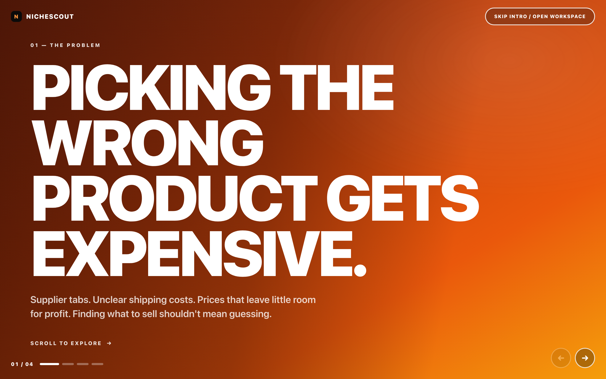
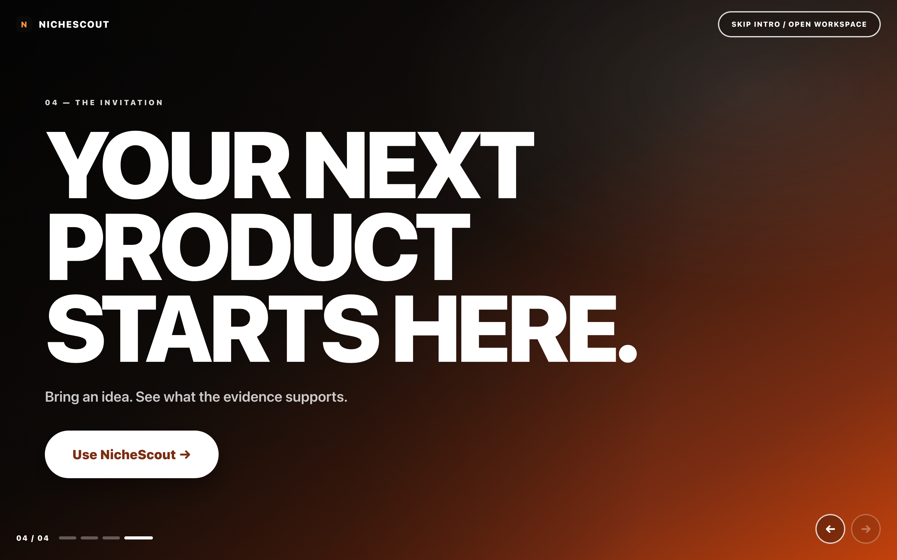
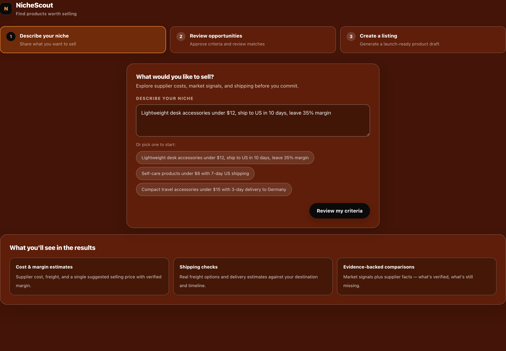
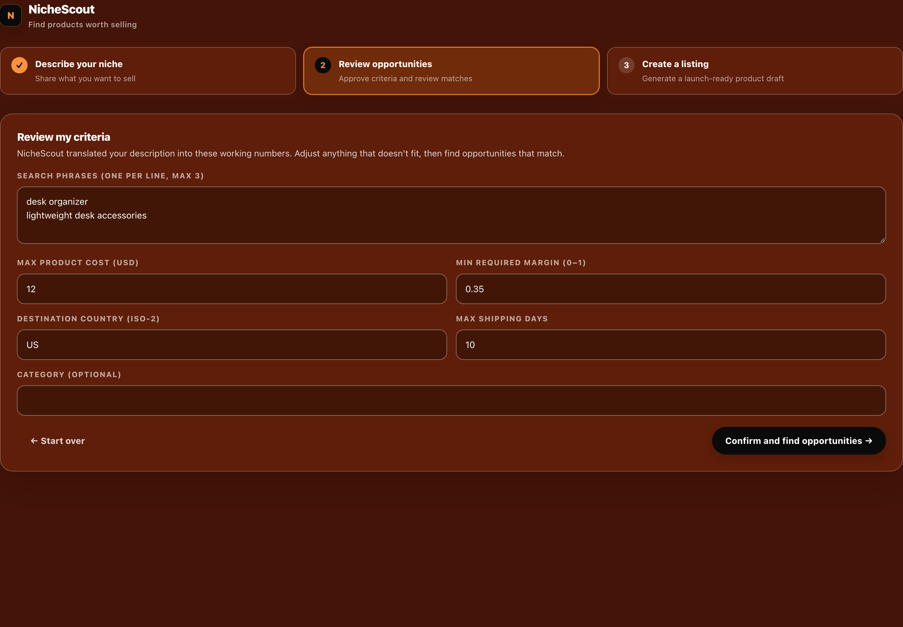
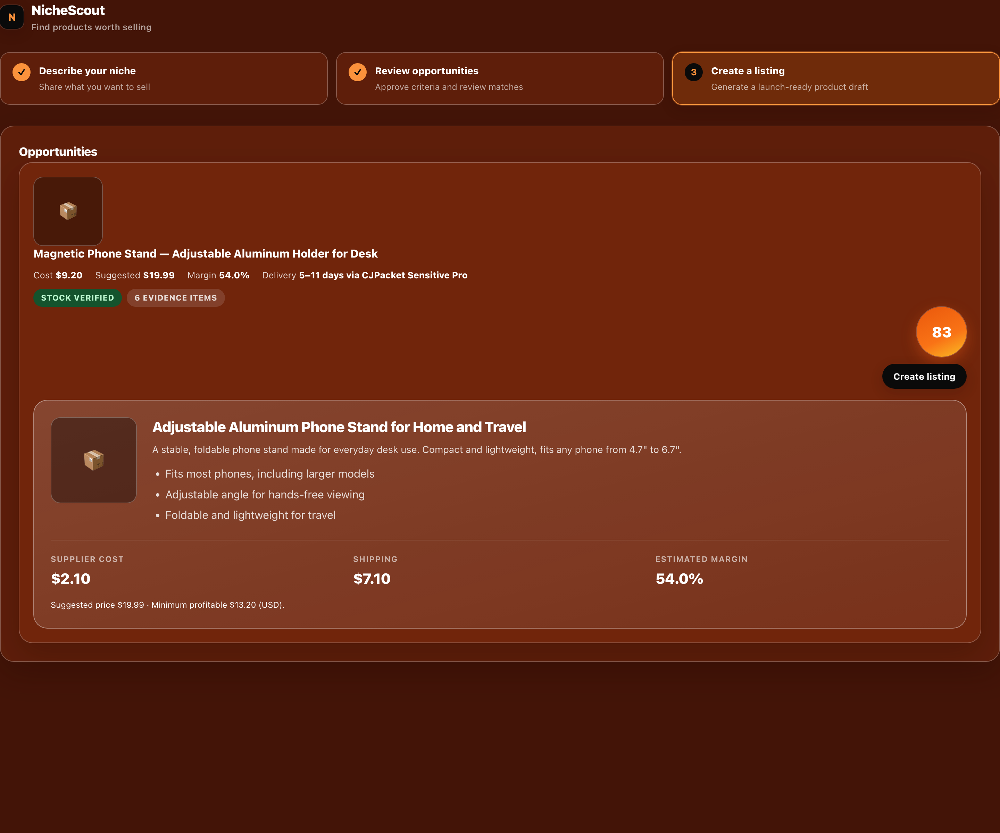
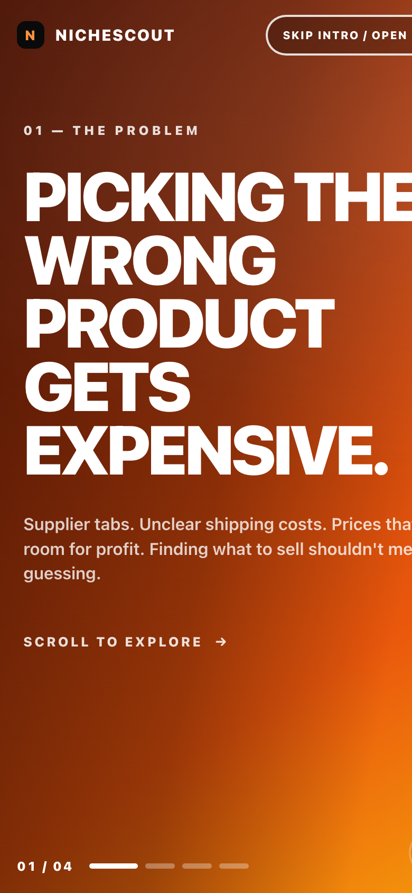

# NicheScout

**Find products worth selling.** NicheScout takes a plain-English description of what you
want to sell, researches real supplier costs and market signals, and tells you which
products meet your criteria — and where the evidence is missing.

Built for dropshippers who are tired of guessing which product to commit to.



---

## What it does

You describe a niche in your own words:

> *"Lightweight desk organizers under $12, ship to the US in 10 days, leave 35% margin"*

NicheScout then:

1. **Interprets** that into structured criteria you can review and edit before anything runs
2. **Researches** real supplier data (CJ Dropshipping) and real market data (Google Shopping, Google Trends)
3. **Scores** each candidate on margin, demand momentum, competition, and fulfillment confidence
4. **Refuses to rank** anything it can't verify — those go to a separate "needs more evidence" section
5. **Generates a listing** (title, description, bullets) for products you approve — grounded only in verified facts

---

## The core design decision: it refuses to guess

Most product-research tools produce a confident answer from thin data. NicheScout does the
opposite. Every score is backed by evidence you can inspect, and **missing evidence can never
pass a gate**:

| Gate | What it prevents |
|---|---|
| Currency must be an explicit provider-supplied code | No comparing supplier USD costs to market prices in an unknown currency |
| Minimum 5 comparable market results | No "competition score" from two data points |
| Shipping must actually be available within your limit | No promising delivery that doesn't exist |
| Stock must be verified | No listing a product that can't ship |
| Margin recomputed at approval time | No approving against stale prices |

When evidence is missing, the product goes to **"Needs more evidence"** with the precise
blocker named — for example: *"No market prices found for 'lightweight desk organizers'.
Google Shopping returned 0 usable results. Try a simpler, more generic product phrase."*

---

## Screenshots

### The intro sequence

| 01 — The problem | 02 — The consequence |
|---|---|
|  |  |

| 03 — The solution | 04 — The invitation |
|---|---|
|  |  |

### The workspace

| Describe your niche | Review and edit criteria |
|---|---|
|  |  |

| Ranked results with evidence | Needs more evidence |
|---|---|
|  |  |

### Mobile



---

## How the scoring works

Four deterministic dimensions, each 0–100, combined into a weighted composite:

| Dimension | Weight | Inputs |
|---|---|---|
| **Margin health** | 35% | Landed cost vs. market median price |
| **Demand momentum** | 25% | Google Trends 12-month slope, direction, stability |
| **Competition opportunity** | 25% | Unique merchants and price spread across market results |
| **Fulfillment confidence** | 15% | Shipping availability, delivery window, verified stock |

All financial figures — product cost, freight, landed cost, minimum viable price, suggested
price, expected margin — are computed by the engine. **The LLM never calculates a price.**

---

## Architecture

```
app/
  page.tsx                  Workspace: describe → criteria → results → listing
  Intro.tsx                 Four-panel horizontal intro sequence
  api/
    interpret/route.ts      Free-text goal → structured constraints (LLM call 1)
    evaluate/route.ts       Supplier + market research → deterministic scoring
    listing/route.ts        Approved product → listing (LLM call 2)
lib/
  scoring.ts                All 0–100 formulas (pure, unit-tested)
  evaluation-engine.ts      Financials, gates, ranking
  cj-client.ts              CJ Dropshipping: products, stock, freight
  serp-client.ts            Google Shopping + Trends
  relevance.ts              Filters loose supplier search matches
  phrase-broaden.ts         Widens over-specific queries that return no data
  listing-guard.ts          Pre-LLM approval validation
  approval-token.ts         HMAC-signed, short-lived approval tokens
  validation.ts             Constraint + currency validation
tests/                      106 unit tests
```

**At most two LLM calls per workflow**: one to interpret the goal, one to write the listing
after you approve a product. Everything between is deterministic.

---

## Run it

```bash
npm install
npm run dev            # http://localhost:3000
npm test               # 106 unit tests
npm run build          # production build
```

### API keys required

Create `.env.local` with these five:

```
CJ_API_KEY=          # cjdropshipping.com → developer settings
SERPAPI_KEY=         # serpapi.com
OPENAI_API_KEY=      # platform.openai.com
OPENAI_MODEL=gpt-5-mini
APP_SIGNING_SECRET=  # openssl rand -hex 32
```

The app degrades with a clear error if any are missing. `./scripts/prepare-env.sh` scaffolds
the file; `./scripts/setup-credentials.sh` collects values with hidden input.

> **A ChatGPT subscription does not provide API access** — you need a separate OpenAI
> platform key with billing enabled.

---

## Cost awareness

NicheScout has **no login and no rate limiting**. Anyone with the URL spends your API
credits. One evaluation uses 3–9 CJ calls and 4–7 SerpApi searches; SerpApi's free tier is
250 searches/month. Set hard spend caps before sharing a deployment. See `DEPLOY.md`.

---

## Testing

```bash
npm test
```

106 tests covering scoring formulas, validation rules, the approval guard (proving failed
checks never reach the LLM), relevance filtering, phrase broadening, and UI copy.

```bash
./scripts/capture-screenshots.sh   # regenerate docs/screenshots/ (offline, no API calls)
./scripts/feasibility-test.mjs     # verify provider APIs against real responses
```

---

## Documentation

- **[PLAN.md](PLAN.md)** — full design spec and scoring definitions
- **[DEPLOY.md](DEPLOY.md)** — deployment walkthrough (GitHub + Vercel)
- **[FEASIBILITY-cj.md](FEASIBILITY-cj.md)** — CJ Dropshipping API verification results

---

## Limitations (honest list)

- **No authentication or rate limiting.** Not safe for public deployment without a gate.
- **CJ shipping costs are estimates.** Real costs vary by weight and destination.
- **Google Shopping doesn't return explicit currency codes.** NicheScout sends `gl=us` and
  accepts the `$` symbol as provider evidence; anything else is treated as unknown.
- **Supplier search is loose.** CJ's full-text search returns broadly-related items, so a
  relevance filter is applied, but it's keyword-based, not semantic.
- **No store integration.** Listings are a preview payload; nothing is published.
